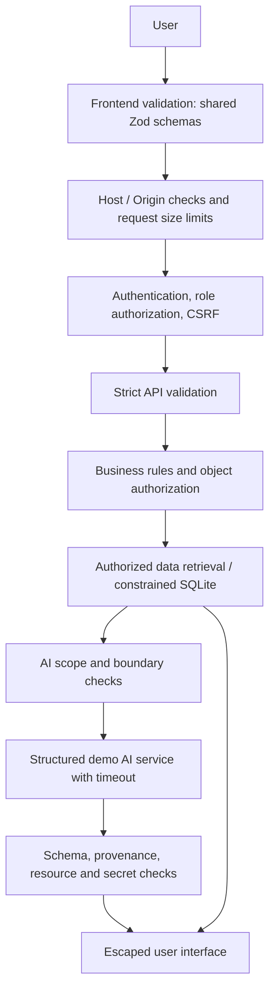

# PathWise AI

A student planning and academic support prototype with a daily focus panel, editable study plans, an advisor cohort view, a structured assistant, and guardrails across the browser, API, authorization, and database.

Repository: https://github.com/VishalOza10/pathwise-ai · Branch: `main`

Live application: https://main.d3w3fisru88s9k.amplifyapp.com/ (AWS Amplify, us-east-1).

Verified October 4, 2026: hosted page, student/advisor login, authorized academic reads, denied foreign records, study-plan persistence across a fresh sign-in, completion/undo/history, academic assistant, deep links, controlled 404, and logout. See `TESTING.md` for the evidence scope and remaining checks. All data is fictional.

## Planning workspace

Open **Study plan** to define an academic goal, hours per week, planning horizon, optional target date, pace, and constraints. A starting value of five hours/week is an editable assumption. Recorded incomplete assignments become work/review steps with estimated effort. Without assignment data the planner supplies clearly identified general study steps, never invented deadlines.

The planner prioritizes high-priority work and earlier deadlines, with prerequisite work before review. It distributes effort over five weekdays in UTC and leaves 15% buffer in Balanced mode, 30% in Gentle mode, and no buffer in Focused mode. Tasks can span multiple study days; their date is estimated completion, not a single uninterrupted appointment. Work past an official deadline or the user's target is flagged with reasons and human follow-up. Constraints entered as notes are displayed but not automatically interpreted as calendar availability.

Users can search, add, remove, rename, reprioritize, estimate, complete, and reopen study steps. Dependency checks prevent completing a blocked review step. Timeline checkpoint progress, the daily focus panel, next actions, and the authorized advisor's student summary derive from these same saved tasks. Study preparation is distinct from assignment submission and does not change grades. Academic completion is incorporated when the user selects **Refresh from progress**.

Natural-language revisions include “I only have three hours per week,” “Make this easier,” “Move the goal to December,” “Add meeting with my advisor,” and “I completed [exact step title].” The assistant and checkboxes share the same task business rules. Ambiguous task names require clarification. Target-date changes require confirmation. The previous edit can be undone for ten minutes; the last 20 events are retained with source and timestamp. Conversation prompts are not kept in audit logs.

The planner is a deterministic service, with no paid model calls. It supports the documented intents, not arbitrary natural-language automation. Resources remain secondary to direct planning. No external institutional action is performed.

## Architecture and hosting

The local app uses Node 24+, Express 5, SQLite, and shared Zod schemas with a small vanilla JavaScript frontend. Planning is split into schemas, scheduling/business rules, routes, and a lazy-loaded UI module. No chart or animation framework is required. Semantic progress bars, checkpoint lists, status labels, and reduced-motion-aware CSS provide accessible visual feedback. Light and dark themes share layout and semantic tokens.

Local academic data lives in SQLite. Each user has an independent plan per authorized student. Students cannot read foreign records; advisors can only read assigned students and have separate planning drafts. An advisor sees the student's saved goal/progress summary in student detail but cannot change it. A version check prevents duplicate or stale edits; mutations and audit entries commit atomically.

For AWS, `npm run build` creates `.amplify-hosting` using the official Amplify deployment specification and Node 24 compute. Static assets go to the CDN; APIs and deep links go to compute. No SPA catch-all rewrite may send `/api/*` to index.html. `server/cloud.js` uses a scoped compute role to persist a compressed, versioned fictional cohort in DynamoDB. SQLite is rebuilt per API request as a validation/business-rule engine. A conditional write must succeed before a successful mutation response or session cookie is returned. Ephemeral compute disk is never treated as durable storage.

This small-cohort adapter is deliberately limited: one versioned cohort, compressed size <=300 KB, expanded size <=4 MB, 150 sessions, 32 tasks per plan, 20 activity entries per plan. Conflicting writes return 409 for refresh/retry. It is not a scalable multi-tenant student information system. A future real-user service should use per-entity durable records, institutional authentication, backups, and a reviewed retention policy.

## AWS Amplify setup and cost

The current deployment uses the directly created on-demand `PathWiseDemoData` table (string partition key `pk`, TTL `expiresAt`) and `PathWiseAmplifyCompute` role attached to the `main` branch only. Its inline policy grants GetItem, PutItem, and UpdateItem on that one table. The trust policy restricts the Amplify app and account. The CloudFormation template below is an alternative for a fresh installation; do not create a duplicate stack for the existing deployment.

1. Connect this new repository's `main` branch to a new Amplify app in `us-east-1`; retain the first application's resources.
2. Use `amplify.yml`: Node 24, `npm ci --ignore-scripts`, tests, then `npm run build`; output `.amplify-hosting`. Platform must be **WEB_COMPUTE** for this Express adapter. The first build cannot serve authenticated data until storage and origin are configured.
3. Review `deploy/storage-role.yml` and create its isolated DynamoDB table and compute role using the new app ID. Attach the role to the **main branch** only. It grants GetItem/PutItem/UpdateItem to this table, with no account-wide access.
4. Set non-secret build values `APP_ORIGIN=https://main.<app-id>.amplifyapp.com`, `PATHWISE_TABLE=<stack table output>`, and `PATHWISE_REGION=us-east-1`. Rebuild. AWS credentials come from the compute role; never put keys in the build or frontend.
5. Keep preview branches and automatic branch creation off. Enable automatic builds only for main. Use the standard build size and free Amplify domain. The hosted demo intentionally uses published fictional credentials; never enter private information.
6. Verify login/logout, student/advisor authorization, plan persistence across refresh/redeploy, AI/manual edits, conflicts, deep links, mobile, keyboard, and reduced motion on the live URL. Review logs without logging request bodies or tokens.

Cost target is near $0 for light classroom use, not a guarantee. Amplify builds, CDN traffic/storage, SSR duration, DynamoDB requests/storage, and CloudWatch logs can cost money outside account allowances. No App Runner, EC2, RDS, NAT gateway, custom domain, WAF subscription, or paid LLM is required. Limit rebuild frequency; set short log retention and a budget alert after reviewing account eligibility. Budget alerts are not spending caps. The CloudFormation table is retained on deletion and can continue accruing storage charges until separately removed with confirmation.

Official references: [Amplify deployment contract](https://docs.aws.amazon.com/amplify/latest/userguide/ssr-deployment-specification.html), [compute roles](https://docs.aws.amazon.com/amplify/latest/userguide/amplify-SSR-compute-role.html), [Amplify pricing](https://aws.amazon.com/amplify/pricing/), [DynamoDB pricing](https://aws.amazon.com/dynamodb/pricing/).

## Verification of the planning upgrade

`npm test` currently passes 32 automated tests, including authorization, schema validation, concurrency, task dependencies, AI ambiguity/injection handling, undo/audit consistency, planning target confirmation, capacity changes, missing data, cloud-state round-trip, and deployment configuration checks. `npm run build` requires a configured HTTPS origin and durable table name before it creates the Amplify bundle; AWS branch/app identifiers can supply the default origin. A successful build does not prove storage access or live health. Browser/deployment verification is tracked in `TESTING.md`.

**All accounts and academic records are fictional.** This is not an official university system. The assistant is a deterministic demo service, not a live LLM, and needs no API key. It helps with recorded courses, assignments, assessments, approved resources, and a small learning library.

## Run locally

Requires Node.js 24 or later. Tested with Node.js 26.8.2.

From this `pathwise` directory:

```sh
npm install
npm start
```

Open **http://localhost:3000**. Use this hostname, rather than `127.0.0.1`, because the application verifies the configured Host and Origin. The server binds only to the local loopback interface.

On Windows, you can also double-click `start-pathwise.cmd` after installing dependencies. It opens a terminal with the server; keep that terminal open while using the app. Press Ctrl+C to stop it.

The app creates its fictional dataset on first start in `data/pathwise.sqlite`. Seed dates are relative to the first start, then persist. Changing the clock does not regenerate data. `npm run dev` restarts the server when source files change.

### Demo sign-in

The default password for all fictional accounts is **`Pathwise-Demo-Only-2026!`**. It is intentionally documented and shown on the demo login screen. It is not a real credential.

- Student: `student@pathwise.example` — Alex Demo, student 1.
- Second student: `jordan@pathwise.example` — Jordan Demo, student 2.
- Advisor: `advisor@pathwise.example` — Morgan Demo; assigned students 1, 2, 4, and 5 only.
- Student with no academic data: `sam@pathwise.example` — Sam Demo, student 3.
- Second advisor: `advisor2@pathwise.example` — Casey Demo; assigned student 3 only.
- Additional students: `riley@pathwise.example` and `avery@pathwise.example` — students 4 and 5, with seeded coursework.

The current dataset contains five fictional students and six course records. A one-time additive migration extends the initial three-student dataset without resetting completion or alert history.

Use the **Dark mode / Light mode** button at the top right of sign-in or any dashboard to change appearance. Before a choice is saved, the app follows the operating system preference. Only the appearance preference is saved in browser local storage; academic data and authentication remain out of browser storage.

The account chooser only fills an email address. The authenticated database record determines the role and permissions. All addresses use the reserved `.example` domain and cannot deliver email.

### Local configuration

Copy `.env.example` to `.env` before first start if you want to customize settings. An ignored local `.env` is included in the working checkout, but not the source archive. Runtime values are read on startup; `.env` is never served to the browser.

- `PORT=3000`: local listening port. If changed, also change `APP_ORIGIN`.
- `APP_ORIGIN=http://localhost:3000`: exact accepted origin and host.
- `DEMO_PASSWORD`: 16–128 characters; used **only when seeding a new database**. Changing it does not change existing hashes. The UI discloses that a custom password replaces the documented default.
- `SESSION_MINUTES=60`: absolute session lifetime, allowed range 1–1440 minutes.
- `AI_MODE=demo`: structured, deterministic assistant. Set `unavailable` and restart to test the failure state.
- `COOKIE_SECURE=false`: appropriate for localhost HTTP. HTTPS hosting requires secure cookies and a separate deployment review.

No JWT or model secret is needed: sessions use random opaque tokens and the assistant runs locally. Do not put genuine API keys, passwords, tokens, or cloud credentials in source code or client configuration.

## What works

- Student overview with recorded courses, latest assessment scores, deadlines, completion tracking, alerts, student-visible notes, and resources.
- Student-owned assignment updates persisted through the API and reflected in recalculated support indicators.
- Advisor overview limited to the advisor’s assigned cohort, with student detail, assessment trends, advisor-only notes, and alert activity.
- Alert workflow: **New → Reviewed → Resolved**, with version checks, confirmation before resolving, and transactional audit history. Reopening is not supported.
- Structured assistant responses with server-selected context, academic redirects, explicit missing-data messages, basic learning examples, and independent failure handling.
- Responsive layout, keyboard focus states, accessible controls, controlled 403/404 views, session expiration, retry controls, and request timeouts.

There are no record deletion, demo reset, file upload, self-registration, password reset, grade editing, or role editing endpoints. Neither role has administrative access. Nothing changes enrollment, aid, admissions, disciplinary status, or institutional outcomes.

## Safety, Privacy, and Application Guardrails

### Independent layers



Non-AI dashboard and workflow requests bypass the assistant entirely. A failed AI request cannot prevent database reads, assignment completion, support calculations, or advisor updates.

### Roles and object-level authorization

Every academic API request first authenticates the session and re-reads the current database role. Unknown roles fail closed. For individual records, the backend checks the associated student and that student’s relationship to the current user. Missing relationships and nonexistent or unauthorized record IDs produce the same 403 response to reduce record enumeration.

Students can read only their own academic records. Their only academic mutation is their own assignment’s `completed` flag. Advisor-only notes are excluded from student responses. Advisors can read only assigned students and update only those students’ alert status. Hiding unavailable UI actions is an additional usability measure, not an authorization control.

Ownership checks cover student detail, courses, assignments, grades, alerts, notes, resources, assistant context, and alert history. The frontend cannot select a different student for a student-session assistant request; a conflicting ID is rejected. Advisors must select an authorized student; the assistant has no unrestricted cohort context.

### Authentication, sessions, and secrets

Passwords are salted and hashed using Node’s scrypt implementation. Login failures are generic; a dummy hash calculation covers unknown accounts. Login rotates an existing session. Session tokens contain 256 bits of randomness; only their SHA-256 hashes are stored in SQLite. Cookies are HttpOnly, SameSite=Strict, scoped to `/`, and have a fixed expiration. Localhost uses HTTP; the optional Secure flag is provided for a reviewed HTTPS environment.

Every mutation verifies the exact Origin and requires JSON. Authenticated mutations also require the session’s CSRF token. Cookies and CSRF tokens never enter browser storage, URLs, logs, or AI context. A session bootstrap endpoint restores authenticated UI state after refresh. Expired, malformed, revoked, or missing sessions return 401; the UI clears its in-memory state and returns to sign-in. A client timer also expires the view, but server expiration is authoritative.

`.gitignore` excludes `.env`, runtime databases, logs, and dependencies. Only `.env.example` is intended for source control. Browser assets are served only from explicit public/shared/vendor directories; database and server files are not exposed. Source archives exclude runtime data and configuration.

### Validation, mass assignment, and errors

The browser and API use the same Zod schema factory. Schemas are strict: unknown keys, wrong types, empty required values, malformed emails, negative versions, invalid IDs, unsupported statuses, and overlong text are rejected. JSON bodies are limited to 16 KB and assistant messages to 2,000 characters. Queries are not supported and unexpected query parameters are rejected.

The API uses explicit SQL columns and bound values. An assignment request accepts only `{ completed, version }`; an alert request accepts only `{ status, version }`. Clients cannot supply grades, student ownership, completion timestamps, risk values, roles, or audit actors. Server-side business rules are applied after authorization and before writes.

Safe API failures use 400, 401, 403, 404, 409, 413, 415, 429, 500, or 503 as appropriate. Responses never include stack traces, SQL errors, file paths, environment contents, or provider output. Unexpected server errors log only a fixed event category, HTTP method, and status. No request bodies or private prompts are logged.

### Database consistency and workflow safety

SQLite foreign keys are enabled. Composite relationships prevent an assignment or grade from referencing another student’s course. Constraints enforce grade ranges, valid statuses, versions, date validity, completion consistency, and resource-link keys. Triggers additionally validate student/advisor relationships, completion dates, and allowed alert transitions.

Optimistic version checks ensure that repeated or concurrent updates cannot apply the same change twice. A stale write receives 409 and the UI refreshes current data. Alert changes and their audit entries execute in one transaction; an audit failure rolls back the change. Audit entries record actor, previous/new status, event, and timestamp, with a seed creation event. History is visible only to authorized advisors.

Important alerts require a confirmation before resolution. Clearing an assistant conversation requires confirmation and affects only in-memory messages in that tab. Harmless completion toggles have no extra dialog. Buttons are disabled while requests are running; a pending-action set protects duplicate UI submissions.

### AI scope, prompt injection, and data minimization

The assistant is intentionally a bounded deterministic service. It does not call an external model, execute instructions from messages, invoke tools, fetch arbitrary URLs, or write academic records. Keyword routing is a convenience for choosing an approved response category, not the security boundary. Even if text evades a routing rule, it can only select a server-authored response backed by authorized data.

Scope includes courses, assignment deadlines, recorded assessments, study planning, academic resources, support alerts, and a small curated learning library (binary search and graph basics). Weather, sports, stock questions, and other unrelated requests redirect to academic support. Requests for secrets, changed restrictions, another student’s records, or role elevation are refused. The assistant does not complete graded exams; it offers learning and planning support. Crisis wording triggers a generic message encouraging emergency or qualified support; it does not diagnose or act as a crisis service. This simple detector is not a comprehensive safety classifier.

Authorization happens before retrieval. A grade question retrieves only that student’s assessment fields and course names; an assignment question retrieves only assignment fields. Boundary responses retrieve no academic rows. Neither user records, emails, credentials, private notes, full cohorts, nor all database tables are passed to the service. The service receives no stored conversation history.

The assistant does not look up people by name in free text. Advisors use the authorized student selector, then ask about the selected record. Named-record lookup requests are conservatively redirected.

Missing facts produce explicit uncertainty. It does not invent office hours, policies, advisor messages, dates, grades, or course requirements. Official questions are routed to an appropriate human office. Public learning resources are labeled as public references rather than claimed university services.

### Structured response validation and fallback

Responses must validate against `{ kind, summary, priorities, recommendedResources, needsAdvisor }`, including size and item limits. Resource IDs must belong to the retrieved authorized context. Basic secret/URL patterns are rejected. Most importantly, the complete response must match the canonical server-generated response, so arbitrary provider text and unauthorized facts are rejected even if the JSON shape is valid. This provenance check is stronger than keyword filtering for the bounded demo.

A future LLM integration cannot safely be added by removing the exact-response check and reusing only the regexes. It needs an independently designed evidence/provenance contract, evaluation suite, and deployment review. The optional injected provider in tests is a fault-injection seam, not a configured production LLM integration.

The assistant deadline is 5 seconds, with cancellation signaled to the provider seam. Every browser API request has a 10-second deadline. Failure returns: “PathWise Assistant is temporarily unavailable. Your academic dashboard is still available.” The chat offers retry; other screens remain independent. No server-side AI prompt or response history is stored.

### Explainable academic support indicators and human oversight

`server/support.js` computes support deterministically from the current recorded assignments and assessments. The same function supplies student and advisor views; it does not call AI.

- No assignment or assessment data: **Not enough data**.
- At least 3 overdue incomplete assignments, or at least 2 overdue incomplete assignments plus an assessment decline: **Elevated support**.
- Any remaining flag: **Moderate support**.
- Data is available but there are no flags: **On track** (no current recorded support flags).

A flag is an overdue incomplete assignment, a drop of at least 5 percentage points between the latest two recorded assessments in any course, or at least 3 incomplete assignments due within the next 5 × 24 hours. Overdue means the stored deadline is earlier than the calculation time. Completed assignments do not count as overdue or upcoming.

Each indicator includes contributing factors, relevant counts or assessment values, a reasoning summary, a calculation timestamp, and a recommended human action. A score is not manufactured. Assessments are not presented as official course averages; the overview’s “assessment snapshot” is explicitly the arithmetic mean of the latest recorded score in each course with data. A trend needs at least two observations. Counts come from actual seeded rows. No model predictions are displayed.

Indicators never automatically resolve alerts or make institutional decisions. They suggest reviewing workload and considering advisor follow-up. Students and advisors remain responsible for interpreting context.

### Rendering and link safety

All dynamic text is escaped before insertion into HTML templates. Chat input and responses are plain text; no model-generated Markdown, HTML, or arbitrary links are rendered. A restrictive Content Security Policy disallows inline script execution, external scripts, framing, and objects. Other security headers are provided by Helmet. There are no third-party scripts, fonts, tracking pixels, or browser console logs of academic data.

Resource URLs come from a fixed backend allowlist and are checked again before the UI makes them clickable. External links use `rel="noopener noreferrer"`. Approved public references are [UNC calendar planning](https://learningcenter.unc.edu/tips-and-tools/using-planners/), [UNC learning tips](https://learningcenter.unc.edu/tips-and-tools/), and [Purdue OWL general writing](https://owl.purdue.edu/owl/general_writing/index.html). These links were checked on October 4, 2026.

### Rate limiting and prototype limits

Login is limited to 20 requests per 15 minutes per IP. The assistant is limited to 30 requests per minute per IP. These development-friendly limits return a friendly 429 response and rate-limit headers. Rate-limit state is in memory; it resets on process restart and is not distributed. The app does not trust forwarded IP headers.

This implements production-style patterns for a local academic prototype, not a claim of production certification. Public use would require institutional identity, HTTPS and deployment hardening, shared rate-limit storage, database migrations/backups, operational monitoring, accessibility review, and institution-specific privacy review. Real student data is outside this prototype’s scope.

## Verification

```sh
npm run check
npm test
```

The automated suite uses a fresh in-memory SQLite database per integration test and a loopback HTTP server on a random port. It never touches `data/pathwise.sqlite`. It tests real cookies, headers, validation, authorization, persisted updates, and response bodies. A simulated audit failure intentionally emits one sanitized server error event.

See `test/guardrails.test.js` for the executable suite and `TESTING.md` for the required manual cases and browser verification record.

## Project layout

- `server/app.js`: authentication, CSRF, permissions, validated API routes, rate limits, safe errors, static serving.
- `server/database.js`: constraints, triggers, fictional seed data, password hashing.
- `server/assistant.js`: intent boundaries, minimal context retrieval, structured responses, provenance checks, timeout.
- `server/support.js`: deterministic support indicators and resource allowlist.
- `shared/validation.js`: shared browser/server Zod schemas.
- `public/`: responsive UI, styles, and local artwork.
- `test/guardrails.test.js`: executable guardrail and failure tests.

The synced project `sources/` directory is not used or modified.
